# Blossom

Blossom is an open-hardware, open-source tensile robot that you can handcraft and accessorize to your liking. You can read more about the project in the [ACM T-HRI Paper](https://doi.org/10.1145/3310356) and in [Evan Ackerman's IEEE Spectrum article](https://spectrum.ieee.org/automaton/robotics/home-robots/blossom-a-creative-handmade-approach-to-social-robotics-from-cornell-and-google).

Here are some examples of Blossom robots:


 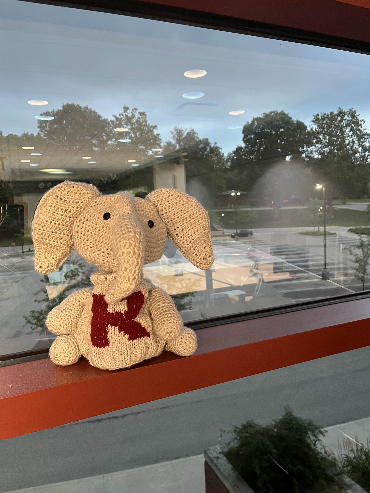

 


----

# Blossom setup guide:

#### if stuck: [original CMU wiki](https://github.com/hrc2/blossom-public/wiki)

## [Setup Guide (click here)](./Setup_Guide.md)

If you already have git and python3.10 installed just run these two commands:

```bash
git clone https://github.com/agmui/blossom-public/tree/master
pip install -r reqirments.txt
```

### Wiring Guide:
#### 1. cables
<table>
 <tr>
    <td><b style="font-size:20px"> U2D2 Cable: </b></td>
    <td><b style="font-size:20px">Uart Cable:</b></td>
 </tr>
 <tr>
    <td> 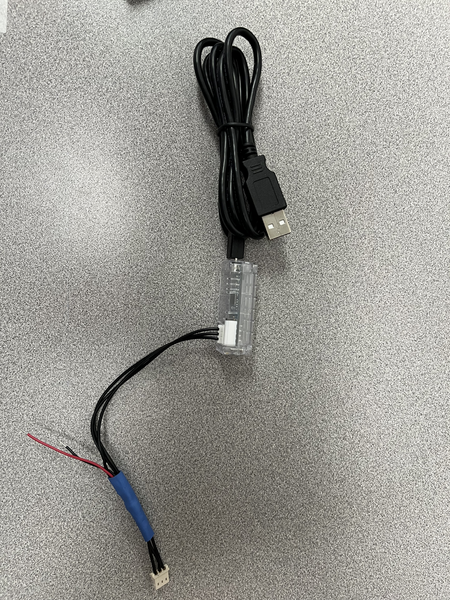 </td>
    <td> 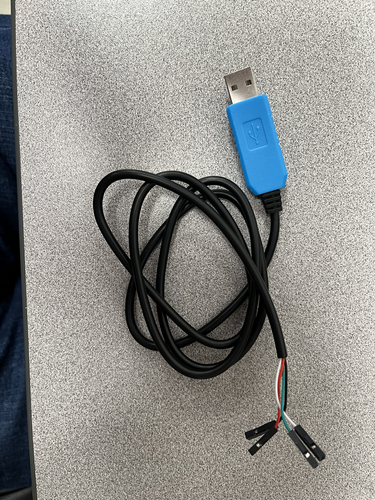 </td>
 </tr>
</table>

#### 2. connect the red pin of the Uart with the red pin of the U2D2 and same with the black pin:

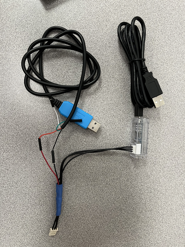

#### 3. connect the cable to the robot

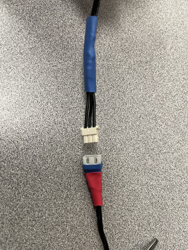 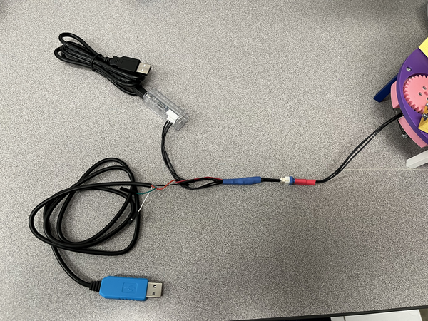

#### 4. connect both the Uart and U2D2 cable to your laptop
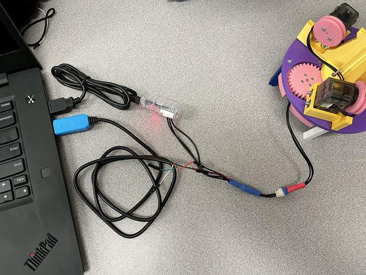

Once the robot is plugged into your laptop type in the terminal:
```bash
python3 simple_test.py
```

The robot should now be moving

### Chat GPT integration 

For the Chat GPT chatbot you will have to pay for a key from OpenAI.  
Your key will look like this:
```env
OPENAI_API_KEY=sk-xxxxxxxxxxxxxxxxxxxxxxxxxxxxxxxxxxxxxxxxxxxxxxxxxxxxx
```

_if you are taking a class at RHIT ask Dr. Berry for the API key_

Create a file called `.env` and paste your key inside:

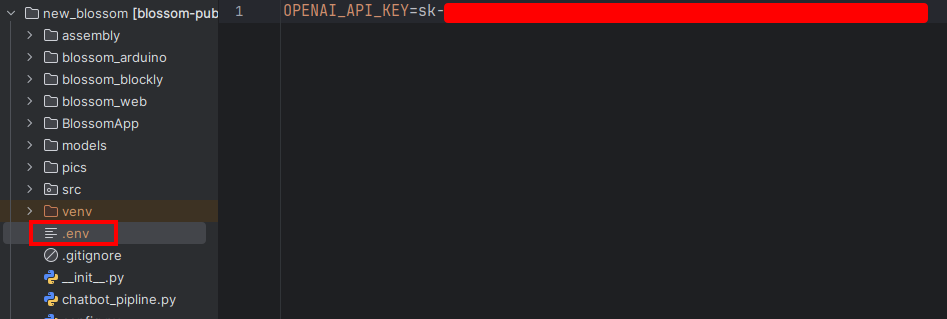

### 🔴IMPORTANT❗🔴 DO NOT SHARE THE API KEY OR PUSH THE `.env` FILE TO GITHUB

---

## Blossom Build Guide

To build your own Blossom, check out the [Build Guide](https://github.com/hrc2/blossom-public/wiki). The rest of this document will teach you how to set up the software to run the robot.

---

## Running Blossom 

TODO: [Interfacing guide](./Interfacing_Guide.md)

### Command Line Interface(CLI)

```bash
usage: start.py [-h] [--names NAMES [NAMES ...]] [--port PORT] [--host HOST] [--browser-disable] [--list-robots]

options:
  -h, --help            show this help message and exit
  --names NAMES [NAMES ...], -n NAMES [NAMES ...]
                        Name of the robot.
  --port PORT, -p PORT  Port to start server on.
  --host HOST, -i HOST  IP address of webserver
  --browser-disable, -b
                        prevent a browser window from opening with the blossom UI
  --list-robots, -l     list all robot names
```

To start the CLI, plug Blossom in and run
```bash
python start.py 
```

To make Blossom nod with the `yes` type:

`s` -> Enter -> `yes`

<details>
<summary>

Common Errors: `could not open port.`
</summary>

You may need to run `sudo chmod 777 [the name of the port]`

Ex: `sudo chmod 777 /dev/ttyACM0`
</details>


_Linux may default to a loopback IP (`127.0.1.1`); in this case you **must** specify the IP address using `-i`._


### Gesture recogniser

*used Google [MediaPipe](https://ai.google.dev/edge/mediapipe/solutions/vision/gesture_recognizer) for model*

```bash
python main.py
```
> _Troubleshooting Error on Mac:_ `could not open port.`
> 
> You may need to run `sudo chmod 777 <the name of the port>.`
>
> Ex: `sudo chmod 777 /dev/ttyACM0`

a window should pop up running the gesture recogniser

press q to close the window

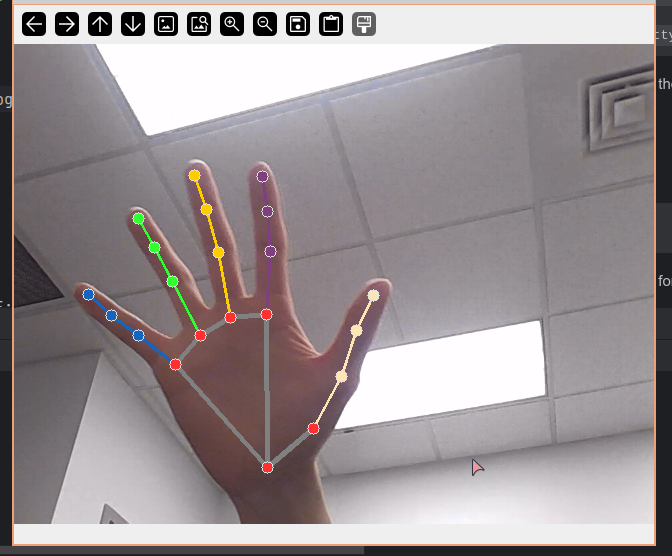


### Chatbot demo run
```bash
python chatbot_pipeline.py
```
then when asked input your mic, for me it was 5:

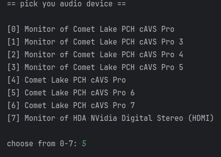

## Project files:
**main.py:**
  * the entry point to the gesture recogniser program
  * the function `on_detection()` is where most of you code should go
    it gets called anytime a gesture gets recognised
  * the result of the detection is placed in a variable called `result` 
  the format is linked here: [result format](https://ai.google.dev/edge/mediapipe/solutions/vision/gesture_recognizer/python)
  * as an example to get the name of the gesture: `gesture_name = result.gestures[0][0].category_name`
 
**utils.py:**
  * helpful functions for starting the robot and gesture recogniser
  * use the function `list_camera_ports()` to get which camera port OpenCV will use

**chatbot_pipline.py:**
  * chatGPT chatbot pipeline
  * to run: `python chatbot_pipeline.py` for a demo
  * use the function `list_audio_devices()` to get which mic you will use
  * to run the whole pipeline:
  ```python
    # input selected audio device index
    cb = ChatBot(mic_index=MIC_INDEX)

    # run the chatbot
    cb.run_pipline()
  ```
  * it will generate speech.mp3 and test.wav everytime it is run. It is used
    to comunicate with the openAI API
* motor_calib.py
  * used for calibrating the motors when initially building the robot
* start.py
  * class that holds all the robot code


---

## [Blossom Arduino](blossom_arduino)

Arduino Giga R1 implementation using the Dynamixel shield for blossom

> Note: this project is not fully finished so there are some missing parts to
> the arduino implementation

### Setup

In the Arduino IDE click on: Tools -> Board -> Boards Manager...

then type Arduino Giga in the search
and download the one called Arduino Mbed OS GIGA Boards

Next you need to download these libs:

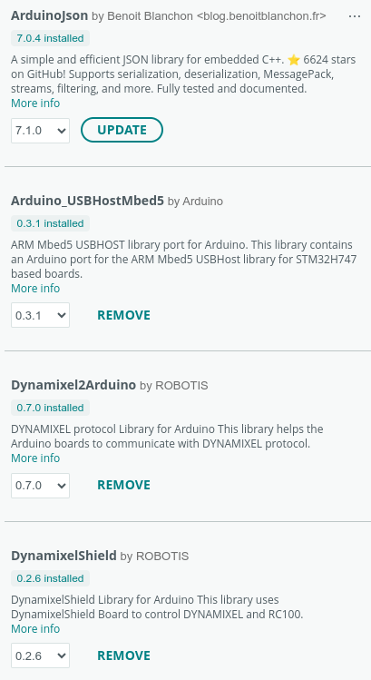

the entry point is in [bloosom.ino](blossom_arduino/arduino_src/bloosom/bloosom.ino)
