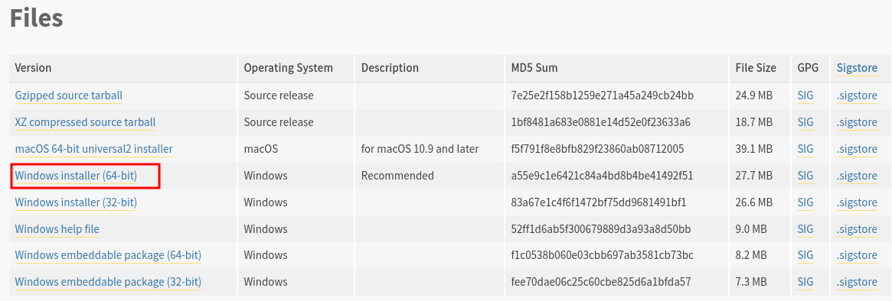
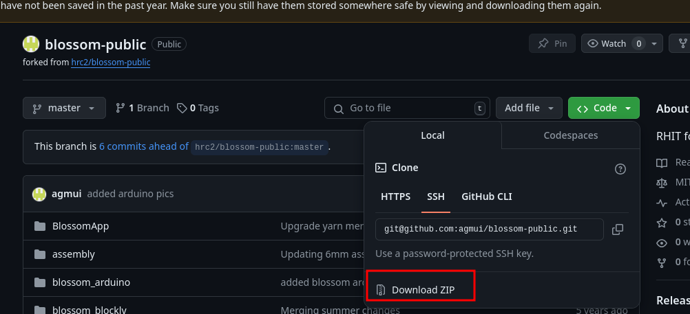
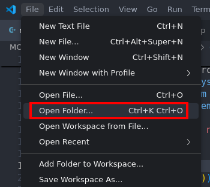

# Setup Guide

* **[Windows](#windows-img-srcpicswindows-logopng-altdrawing-width30)**
* **[Mac](#mac-img-srcpicsapple-logo_f8ffpng-altdrawing-width40)**
* **[Linux](#linux-)**

## Windows 

The Window install guide assumes you have taken the RHIT class but this guide should
work for anyone

### 1. Downloading python3.10 and pip

> if you already have python you can skip this step

Install python3.10 for your Operating System:
[Windows python installer link](https://www.python.org/downloads/release/python-31011/)

scroll down to find the installer:


go thought the installer process
### 🔴IMPORTANT❗🔴 remember to click add to path at the end:


### 2. Download blossom code from GitHub

> If you already have git run:
> ```bash
> git clone https://github.com/agmui/blossom-public.git
> ```

Otherwise, download the code by clicking `Download ZIP`:



unzip it to a known location

### 3. Download VScode

Skip this step if you already have an working IDE

Install [VScode](https://code.visualstudio.com/download)
and once inside VScode open the `blossom-public` folder you just unzipped with `File` -> `Open Folder`



<details> <summary>PyCharm Setup (if you want to use PyCharm instead of VScode)</summary>
on the top left click File->Open

and click the folder you just unzipped and hit ok
</details>

### 4. Installing dependencies with pip

open the terminal, for VScode click `View` -> `Terminal`


type this into the terminal and hit enter this will install all dependencies:

```bash
pip install -r requirements.txt
```

When doing this there maybe warnings that can be ignored

[//]: # (If you get an error saying that pip is not installed)


If there were no errors congratulations!  
The wiring guide and ChatGPT integration will be explained in the main guide

## Mac 

### 1. Install python3:

open a terminal and type:

```bash
/bin/bash -c "$(curl -fsSL https://raw.githubusercontent.com/Homebrew/install/master/install.sh)"
export PATH="/usr/local/opt/python/libexec/bin:$PATH"
brew install python
```

### 2. Installing dependencies with pip

```
pip install -r requirements.txt --user
```
> _If this still doesn't work, you may have to append `sudo` before `pip`:_
> ```
> sudo pip install -r requirements.txt --user
> ```
_This may require you to run in `sudo` for subsequent steps._

_It may take a while to install the dependencies; you may want to run `pip` verbose to make sure that it's still downloading: `pip install -rv requirements.txt`_

_If you run into an error opening a port, try changing Blossom's permissions: `sudo chmod 777 /dev/ttyACM0`.
Alternatively, rerun everything with admin privileges._

_If you're using OSX and getting strange errors, try:_
```
sudo chown -R $USER /Library/Python/3.5
```


## Linux 🐧
First install python for your specific distro: (for ubuntu that is: `sudp apt install python3`)

_Ubuntu_: You may need to run
```
sudo apt-get install build-essential libssl-dev libffi-dev python3-dev  
``` 
and
```
pip install wheel
```

To install dependencies, run in the main `blossom` directory:
```
pip install -r requirements.txt
```

_If this still doesn't work, you may have to append `sudo` before `pip`:_
```
sudo pip install -r requirements.txt 
```
_This may require you to run in `sudo` for subsequent steps._

_It may take a while to install the dependencies;
you may want to run `pip` verbose to make sure that it's still downloading: `pip install -rv requirements.txt`_

_If you run into an error opening a port, try changing Blossom's permissions: `sudo chmod 777 /dev/ttyACM0`. Alternatively, rerun everything with admin privileges._

_Installation will take longer on a Raspberry Pi, and you may need additional dependencies:_
```
sudo apt-get install xvfb
```
