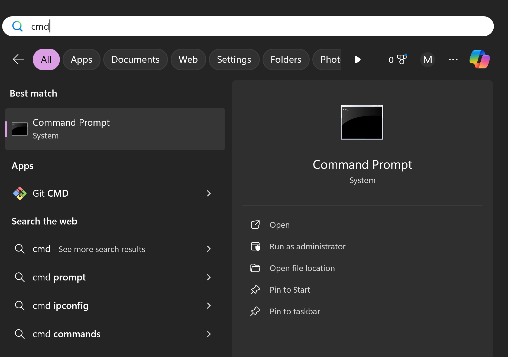
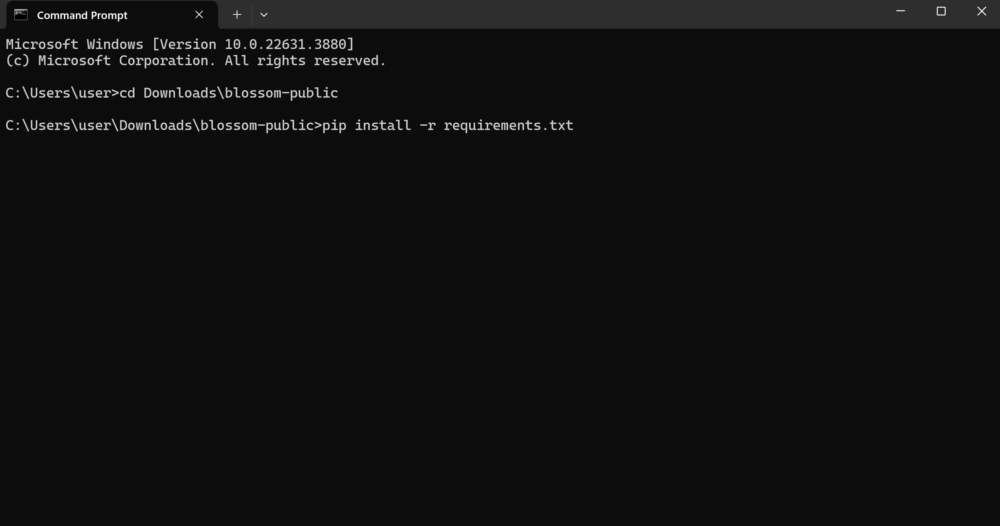

# Install Guide

## Windows 

The Window install guide assumes you have taken the RHIT class but this guide should
work for anyone

### 1. Install python3.10:

scroll down to find the installer:
[Windows python installer link](https://www.python.org/downloads/release/python-31011/)

### 2. Download blossom code


unzip it to a known location

### 3. Open PyCharm  

on the top left click File->Open

and click the folder you just unzipped and hit ok

Then click on terminal on the bottem left and type in this

<details open>
<summary>what if I dont have pycharm?</summary>
<br>

Type `cmd` in the windows search bar to open the command line:

go to where you unziped the repo:
```bash
cd <unziped folder location>
```
</details>

```bash
pip install -r requirements.txt
```



If there were no errors congratulations you can go back to the main guide

## Mac 

First install python3:
```bash
/bin/bash -c "$(curl -fsSL https://raw.githubusercontent.com/Homebrew/install/master/install.sh)"
export PATH="/usr/local/opt/python/libexec/bin:$PATH"
brew install python
```

Then install the required python pakages
```
pip install -r requirements.txt --user
```
> _If this still doesn't work, you may have to append `sudo` before `pip`:_
> ```
> sudo pip install -r requirements.txt --user
> ```
_This may require you to run in `sudo` for subsequent steps._

_It may take a while to install the dependencies; you may want to run `pip` verbose to make sure that it's still downloading: `pip install -rv requirements.txt`_

_If you run into an error opening a port, try changing Blossom's permissions: `sudo chmod 777 /dev/ttyACM0`.
Alternatively, rerun everything with admin privileges._

_If you're using OSX and getting strange errors, try:_
```
sudo chown -R $USER /Library/Python/3.5
```


## Linux 🐧
First install python for your specific distro: (for ubuntu that is: `sudp apt install python3`)

_Ubuntu_: You may need to run
```
sudo apt-get install build-essential libssl-dev libffi-dev python3-dev  
``` 
and
```
pip install wheel
```

To install dependencies, run in the main `blossom` directory:
```
pip install -r requirements.txt
```

_If this still doesn't work, you may have to append `sudo` before `pip`:_
```
sudo pip install -r requirements.txt 
```
_This may require you to run in `sudo` for subsequent steps._

_It may take a while to install the dependencies;
you may want to run `pip` verbose to make sure that it's still downloading: `pip install -rv requirements.txt`_

_If you run into an error opening a port, try changing Blossom's permissions: `sudo chmod 777 /dev/ttyACM0`. Alternatively, rerun everything with admin privileges._

_Installation will take longer on a Raspberry Pi, and you may need additional dependencies:_
```
sudo apt-get install xvfb
```
